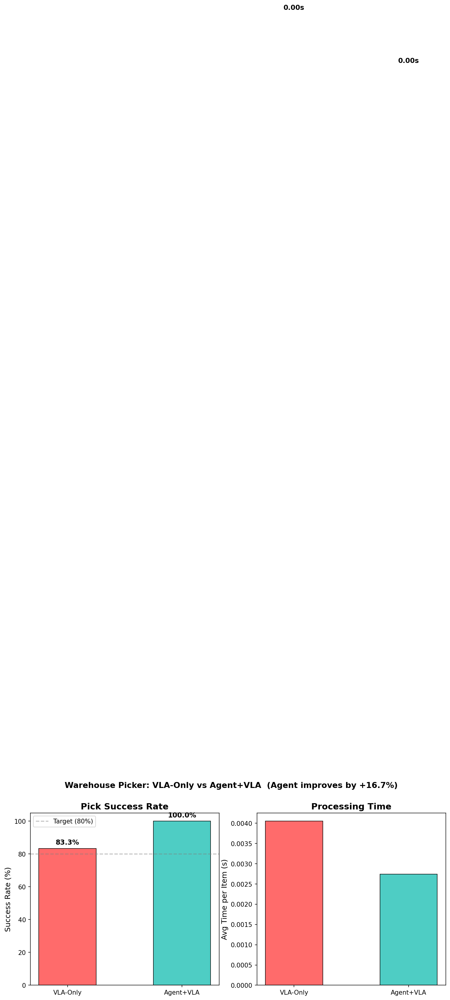

# Warehouse Picker VLA

**Agentic VLA system for autonomous warehouse order picking with error recovery.**

An LLM-based orchestrator (Planner + Verifier) directs a Vision-Language-Action model (SmolVLA) to pick items from warehouse shelves, verify success via camera feedback, and autonomously recover from grip failures and object drops.

## Architecture

```
                        ┌──────────────────────┐
                        │    Natural Language   │
                        │      Order Input      │
                        └──────────┬───────────┘
                                   │
                        ┌──────────▼───────────┐
                        │     Orchestrator      │
                        │  ┌───────────────┐    │
                        │  │   Planner     │    │  ← Claude LLM
                        │  │  (parse,plan, │    │    Order parsing
                        │  │   replan)     │    │    Pick planning
                        │  └───────┬───────┘    │    Failure recovery
                        │          │            │
                        │  ┌───────▼───────┐    │
                        │  │ Task Manager  │    │  ← State Machine
                        │  │ (state,retry, │    │    IDLE→PLAN→EXEC
                        │  │  skip,report) │    │    →VERIFY→SUCCESS
                        │  └───────┬───────┘    │
                        │          │            │
                        │  ┌───────▼───────┐    │
                        │  │   Verifier    │    │  ← Claude Vision
                        │  │  (pick,place, │    │    Success/failure
                        │  │   grip check) │    │    Recovery advice
                        │  └───────────────┘    │
                        └──────────┬───────────┘
                                   │
                        ┌──────────▼───────────┐
                        │      Executor         │
                        │  ┌───────────────┐    │
                        │  │   VLA Node    │    │  ← SmolVLA (450M)
                        │  │  (SmolVLA /   │    │    MPS inference
                        │  │   Scripted)   │    │    224x224 input
                        │  └───────┬───────┘    │
                        │  ┌───────▼───────┐    │
                        │  │   Action      │    │  ← [-1,1] → joint
                        │  │  Converter    │    │    angles + gripper
                        │  └───────────────┘    │
                        └──────────┬───────────┘
                                   │
                        ┌──────────▼───────────┐
                        │    Simulation         │
                        │  Gazebo + ROS2        │
                        │  (Docker container)   │
                        │                       │
                        │  3 shelves · 6 objects │
                        │  6-DOF arm · camera   │
                        │  ZMQ bridge ↔ host    │
                        └───────────────────────┘
```

## Key Features

- **Hierarchical VLA Architecture**: LLM Planner (high-level reasoning) + VLA Executor (low-level motor control) + LLM Verifier (success assessment)
- **Autonomous Error Recovery**: Grip failure detection, dropped object floor pickup, max-retry skip with order continuation
- **Multi-Item Order Processing**: Sequential task queue with state machine (IDLE → PLANNING → EXECUTING → VERIFYING → SUCCESS/REPLANNING/SKIPPED)
- **Adversarial Robustness**: Object teleport mid-pick → detection → replanning → recovery
- **A/B Benchmarking**: VLA-only vs Agent+VLA comparison with visualization

## Benchmark Results

| Metric | VLA-Only | Agent+VLA | Improvement |
|--------|----------|-----------|-------------|
| Success Rate (mock) | 83.3% | 100.0% | +16.7% |
| Recovery | None | Grip retry + floor pickup | Full |
| Multi-item | Single attempt | 3 retries + skip | Robust |



## Quick Start

```bash
# Clone and setup
git clone <repo-url> && cd VLA
python3.12 -m venv .venv && source .venv/bin/activate
pip install torch torchvision transformers accelerate pillow pyyaml pytest lerobot pyzmq rich matplotlib

# Run tests (120 tests across 6 sprints)
pytest tests/ -v -k "not slow and not gpu and not docker and not vision"

# Run demo
bash scripts/demo.sh

# Run benchmark
python -m scripts.benchmark

# Generate A/B chart
python -m scripts.visualize_comparison

# Replay a log file
python -m scripts.replay <logfile.jsonl>
```

## Project Structure

```
VLA/
├── src/
│   ├── orchestrator/          # Agentic orchestrator
│   │   ├── planner.py         # Order parsing, pick planning, replanning
│   │   ├── verifier.py        # Vision-based pick/place/grip verification
│   │   ├── task_manager.py    # State machine, retry, skip, reports
│   │   ├── picking_loop.py    # Integrated Plan→Execute→Verify loop
│   │   ├── reasoning_trace.py # LLM reasoning capture + rich UI
│   │   ├── claude_wrapper.py  # claude -p CLI wrapper
│   │   └── prompts/           # Planner/Verifier prompt templates
│   ├── executor/              # VLA execution
│   │   ├── vla_node.py        # SmolVLA inference node
│   │   ├── action_converter.py # VLA output → joint commands
│   │   ├── bridge_host.py     # Host-side ZMQ bridge
│   │   └── models/            # Model loader (SmolVLA/Scripted)
│   ├── simulation/            # Gazebo environment
│   │   ├── worlds/warehouse.sdf
│   │   ├── robot_control.py   # 6-DOF arm controller
│   │   ├── camera_capture.py  # Camera image capture
│   │   └── bridge_docker.py   # Docker-side ZMQ bridge
│   └── common/                # Shared utilities
│       ├── types.py           # TaskState, PickTask, Order, etc.
│       ├── config.py          # YAML config loader
│       └── logger.py          # JSONL structured logger
├── tests/                     # 120+ tests (TDD, all sprints)
├── scripts/
│   ├── demo.sh                # Full system demo
│   ├── benchmark.py           # A/B benchmark runner
│   ├── visualize_comparison.py # Matplotlib chart generator
│   ├── demo_adversarial.py    # Adversarial teleport demo
│   └── replay.py              # Log replay system
├── configs/                   # YAML configs (warehouse, robot, objects)
├── docker/                    # Dockerfile + compose for ROS2+Gazebo
└── docs/
    ├── ARCHITECTURE.md        # Detailed data flow
    ├── PRD.md                 # Product requirements
    ├── EXECUTION_PLAN.md      # Sprint plan
    └── progress/              # Sprint reports (0-5)
```

## Tech Stack

| Layer | Technology | Purpose |
|-------|-----------|---------|
| Planner | Claude (claude -p) | Order parsing, pick planning, failure replanning |
| Verifier | Claude Vision | Camera-based success/failure verification |
| Executor | SmolVLA (450M) + PyTorch MPS | Robot action prediction from images |
| Middleware | ROS2 Jazzy | Standard robotics communication |
| Simulator | Gazebo Harmonic | Physics simulation (Docker) |
| Bridge | ZMQ (port 5555/5556) | Docker ↔ macOS host communication |
| Language | Python 3.12 | Full stack |

## State Machine

```
IDLE → PLANNING → EXECUTING → VERIFYING → SUCCESS
                                  │
                                  ▼
                            REPLANNING → EXECUTING (retry)
                                  │
                                  ▼ (max retries)
                               SKIPPED
```

## Current Status & Known Limitations

This project is a **portfolio demonstration** of the agentic VLA architecture. The software architecture (state machine, Planner/Verifier/Executor separation, error recovery loop, prompt design) is fully functional with 140 passing tests.

**Known limitations:**

1. **SmolVLA inference is mock**: The model loads on MPS correctly, but `predict()` uses random action sampling (`torch.randn + tanh`) instead of the full LeRobot inference pipeline. The model is not fine-tuned on the Gazebo domain. Real inference requires connecting the LeRobot tokenizer and action head.

2. **ROS2 bridge stubs**: `bridge_docker.py` has 3 unimplemented ROS2 `rclpy` publish/subscribe calls (ZMQ transport layer is complete). Filling these in connects the bridge to actual Gazebo topics.

3. **Benchmark numbers are seeded mock results**: The 83.3%/100.0% figures come from `random.Random(42)` with hardcoded probability constants, not from actual Gazebo robot trials. They demonstrate the benchmark framework, not measured performance.

**Next steps to make it real:**
- Connect SmolVLA real inference via LeRobot pipeline
- Fill ROS2 bridge stubs and run end-to-end in Docker + Gazebo
- Collect sim data and fine-tune SmolVLA on Gazebo domain

## References

- [SmolVLA](https://arxiv.org/abs/2506.01844) — 450M parameter VLA model
- [LeRobot](https://github.com/huggingface/lerobot) — Robot learning framework
- [SayCan](https://say-can.github.io/) — Affordance grounding
- [Inner Monologue](https://innermonologue.github.io/) — Feedback-based replanning
- [Agentic Robot](https://arxiv.org/abs/2505.23450) — LLM-orchestrated robot manipulation
